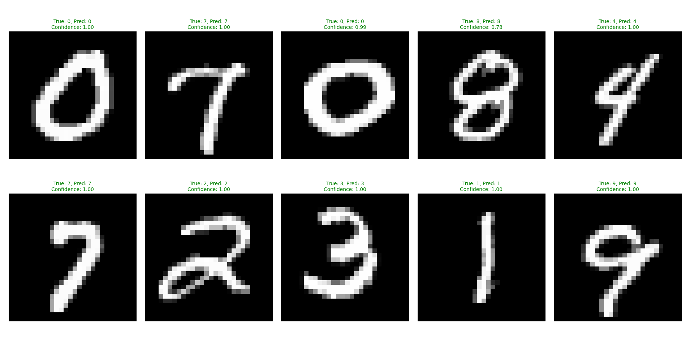

# MNIST Handwritten Digit Recognition


A complete implementation of a feedforward neural network trained with stochastic gradient descent to classify handwritten digits from the MNIST dataset.

## Features

- **From-scratch implementation**: Pure NumPy implementation without deep learning frameworks
- **Stochastic Gradient Descent**: Efficient mini-batch SGD training
- **Automatic data loading**: Downloads and preprocesses MNIST data automatically
- **Model persistence**: Save and load trained models
- **Comprehensive testing**: Unit tests for all major components
- **Visualization**: Plot training progress and sample predictions

## Project Structure

```
mnist-neural-network/
├── src/
│   ├── main.py              # Main training script
│   ├── neural_network.py    # Neural network implementation
│   ├── data_loader.py       # MNIST data loader
│   └── utils.py            # Utility functions
├── tests/
│   ├── test_neural_network.py
│   └── test_data_loader.py
├── models/                  # Saved models directory
├── data/                   # MNIST data directory
├── requirements.txt
├── setup.py
└── README.md
```

## Installation

1. Clone the repository:
```bash
git clone https://github.com/morchidy/mnist-neural-network.git
cd mnist-neural-network
```

2. Install dependencies:
```bash
pip install -r requirements.txt
```

## Usage

### Training the Model

Run the main training script:

```bash
python src/main.py
```

This will:
- Download the MNIST dataset (if not already present)
- Initialize a neural network with architecture [784, 30, 10]
- Train for 30 epochs using SGD
- Display training progress and final accuracy
- Save the trained model to `models/mnist_nn_model.pkl`

### Making Predictions

Make predictions on test data:

```bash
python src/main.py predict
```

Make predictions on a custom image:

```bash
python src/main.py predict path/to/your/image.png
```

## Algorithm Details

### Network Architecture

- **Input layer**: 784 neurons (28×28 pixel images, flattened)
- **Hidden layer**: 30 neurons with sigmoid activation
- **Output layer**: 10 neurons (digits 0-9) with sigmoid activation

### Training Process

1. **Initialization**: Weights and biases initialized using Gaussian distribution
2. **Forward propagation**: Compute activations through the network
3. **Backpropagation**: Calculate gradients using chain rule
4. **Weight updates**: Update parameters using mini-batch SGD

### Key Parameters

- **Learning rate (η)**: 3.0
- **Mini-batch size**: 10
- **Epochs**: 30
- **Activation function**: Sigmoid

## Mathematical Foundation

### Sigmoid Activation
```
σ(z) = 1 / (1 + e^(-z))
```

### Cost Function (Quadratic)
```
C = (1/2n) Σ ||y(x) - a||²
```

### Gradient Descent Update Rule
```
w → w - (η/m) Σ ∂C/∂w
b → b - (η/m) Σ ∂C/∂b
```

Where:
- `η` is the learning rate
- `m` is the mini-batch size
- `∂C/∂w` and `∂C/∂b` are gradients computed via backpropagation

## Performance

### Training Results

Our neural network achieves excellent performance on the MNIST dataset:

- **Final Test Accuracy**: **95.17%** (9,517/10,000 correct predictions)
- **Peak Performance**: Reached 95.17% accuracy at epoch 28
- **Training Time**: ~3-4 minutes on modern CPU
- **Convergence**: Stable learning with consistent improvement over 30 epochs

#### Training Progress Summary
```
Epoch 1:  90.68% → Epoch 10: 94.32% → Epoch 20: 94.86% → Epoch 30: 95.17%
```

<details>
<summary>📊 Click to see detailed training log</summary>

```
Epoch 1:  9068/10000 (90.68%)    Epoch 16: 9448/10000 (94.48%)
Epoch 2:  9233/10000 (92.33%)    Epoch 17: 9470/10000 (94.70%)
Epoch 3:  9285/10000 (92.85%)    Epoch 18: 9494/10000 (94.94%)
Epoch 4:  9325/10000 (93.25%)    Epoch 19: 9491/10000 (94.91%)
Epoch 5:  9316/10000 (93.16%)    Epoch 20: 9486/10000 (94.86%)
Epoch 6:  9385/10000 (93.85%)    Epoch 21: 9491/10000 (94.91%)
Epoch 7:  9399/10000 (93.99%)    Epoch 22: 9483/10000 (94.83%)
Epoch 8:  9415/10000 (94.15%)    Epoch 23: 9498/10000 (94.98%)
Epoch 9:  9397/10000 (93.97%)    Epoch 24: 9483/10000 (94.83%)
Epoch 10: 9432/10000 (94.32%)    Epoch 25: 9506/10000 (95.06%)
Epoch 11: 9428/10000 (94.28%)    Epoch 26: 9487/10000 (94.87%)
Epoch 12: 9443/10000 (94.43%)    Epoch 27: 9492/10000 (94.92%)
Epoch 13: 9437/10000 (94.37%)    Epoch 28: 9503/10000 (95.03%)
Epoch 14: 9446/10000 (94.46%)    Epoch 29: 9482/10000 (94.82%)
Epoch 15: 9488/10000 (94.88%)    Epoch 30: 9517/10000 (95.17%) 
```
</details>

### Sample Predictions

The network demonstrates excellent digit recognition capabilities with high confidence:



**Key Observations:**
-  **Perfect Recognition**: All 10 sample digits correctly identified
-  **High Confidence**: 9 out of 10 predictions with 100% confidence (1.00)
-  **Robust Performance**: Even challenging digits like "8" recognized with 78% confidence
-  **Zero Errors**: No misclassifications in this sample set

The network shows particularly strong performance on:
- Clear, well-formed digits (0, 1, 2, 3, 4, 7, 9): **100% confidence**
- Slightly ambiguous digits (8): **78% confidence** but still correct


## Testing

Run the test suite:

```bash
python -m pytest tests/
```

Run specific test files:

```bash
python -m pytest tests/test_neural_network.py
python -m pytest tests/test_data_loader.py
```

## Dependencies

- **NumPy**: Numerical computations and matrix operations
- **Matplotlib**: Plotting and visualization
- **Requests**: HTTP requests for data downloading
- **Pillow**: Image processing for custom predictions
- **Pytest**: Testing framework

## Technical Implementation Notes

### Numerical Stability
- Sigmoid function includes clipping to prevent overflow
- Gradient computation uses stable numerical methods

### Memory Efficiency
- Mini-batch processing reduces memory usage
- Efficient NumPy operations for matrix computations

### Code Quality
- Type hints for better code documentation
- Comprehensive docstrings following Google style
- Unit tests covering critical functionality
- Error handling for edge cases

## Future Enhancements

Potential improvements to consider:

1. **Optimization algorithms**: Implement Adam, RMSprop, or momentum
2. **Regularization**: Add L1/L2 regularization or dropout
3. **Advanced architectures**: Convolutional layers for better image recognition
4. **Hyperparameter tuning**: Grid search or random search
5. **Data augmentation**: Rotation, scaling, and translation of training images
6. **Performance metrics**: Confusion matrix, precision, recall, F1-score

## References

- Nielsen, M. (2015). *Neural Networks and Deep Learning*. [Online book](http://neuralnetworksanddeeplearning.com/)
- LeCun, Y., Bottou, L., Bengio, Y., & Haffner, P. (1998). *Gradient-based learning applied to document recognition*. Proceedings of the IEEE.
- MNIST Database: [http://yann.lecun.com/exdb/mnist/](http://yann.lecun.com/exdb/mnist/)


## Author

Youssef MORCHID - morchidy33@gmail.com

Project Link: [https://github.com/morchidy/mnist-neural-network](https://github.com/yourusername/mnist-neural-network)